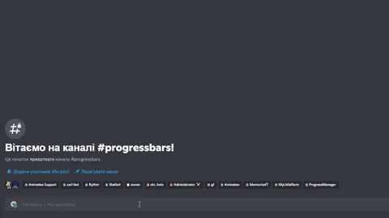

<div id="top"></div>


<h1 align="center">Python-Multibar Examples</h1>
<p align="center">
<br />
<a href="https://github.com/Animatea/python-multibar/tree/main/examples/discord_example/hikari_tanjun_example">Hikari-Tanjun</a>
·
<a href="https://github.com/Animatea/python-multibar/tree/main/examples/discord_example/hikari_lightbulb_example">Hikari-Lightbulb</a>
·
<a href="https://github.com/Animatea/python-multibar/tree/main/examples/discord_example/disnake_example">Disnake</a>
·
<a href="https://github.com/Animatea/python-multibar/tree/main/examples/discord_example/discord_py_example">Discord.py</a>
</p>

<br/>

# How To Run
### ● First clone repository
```bash
$ git clone https://github.com/Animatea/python-multibar.git
```

### ● If you want to use exiting implementation (optional caching with JSON)
Rename `data.json.example` to `data.json`
> **Note** that you can quite simply write your own implementations of interfaces
> (
> [`leveling.api.repository.UserRepositoryAware`](https://github.com/Animatea/python-multibar/tree/main/examples/discord_example/leveling/api/repository.py),
> [`leveling.api.unit_of_work.AbstractUserUnitOfWork`](https://github.com/Animatea/python-multibar/tree/main/examples/discord_example/leveling/api/unit_of_work.py)
> )
> using,
> for example, MongoDB or PostgreSQL etc.

### ● Put your guild ID into any of discord implementations in (*example/bot.py)
Replace `Your_Guild_ID` with your guild ID to enable application commands.

### ● Specify your bot token
In `discord.py`/`disnake` - specify your token in [`launcher.py`](https://github.com/Animatea/python-multibar/tree/main/examples/discord_example/launcher.py)

In any `hikari` example - specify your token in [`*example/bot.py`](https://github.com/Animatea/python-multibar/tree/main/examples/discord_example/hikari_tanjun_example/bot.py)

### ● Then:
- Go to examples/discord_example dir
- Run launcher.py file
    - `NOTE:` You can choose and install any launcher in launcher.py, or even create your own.<br/>
      **Currently implemented:**
        - [HikariTanjunLauncher](https://github.com/Animatea/python-multibar/tree/main/examples/discord_example/launcher.py)
        - [HikariLightbulbLauncher](https://github.com/Animatea/python-multibar/tree/main/examples/discord_example/launcher.py)
        - [DiscordpyLauncher](https://github.com/Animatea/python-multibar/tree/main/examples/discord_example/launcher.py)
        - [DisnakeLauncher](https://github.com/Animatea/python-multibar/tree/main/examples/discord_example/launcher.py)


### ● Demonstration:
<a href=""></a>

